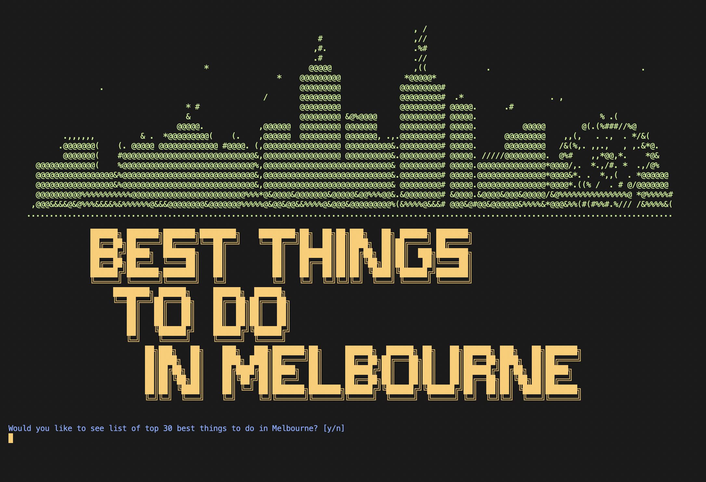
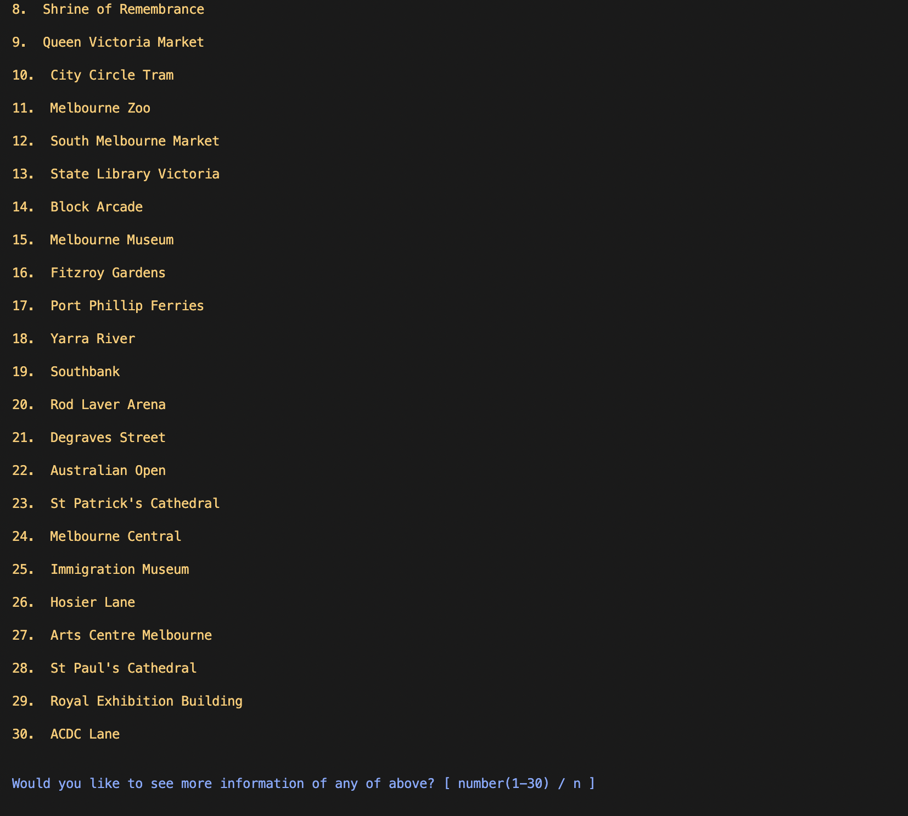
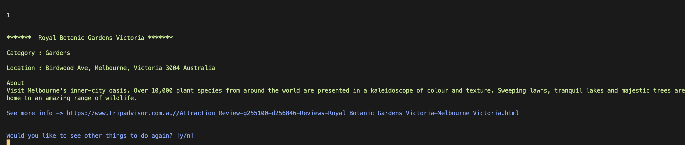

# CLI-ruby-project

### Best Things To Do In Melbourne

#### This CLI app provides a list of 30 best things to do in Melbourne. The data is scraped from Trip Advisor website.

(last updated : 05/10/22)
### 💻 Used Stacks 💻


## Used Gems

* <a href="https://rubygems.org/gems/nokogiri/versions/1.13.8">Nokogiri</a>

* <a href="https://rubygems.org/gems/open-uri/versions/0.2.0">Open Uri</a>

* <a href="https://rubygems.org/gems/tty-link/versions/0.1.0">TTY-Link</a>

* <a href="https://rubygems.org/gems/colorize/versions/0.8.1">Colorize</a>

## Getting Started 

To install gem
```
$ gem install 'best-things-to-do-in-melbourne'
```
start irb then start the app by
```
$ irb
```
```
$ BestThingsToDoInMelbourne::CLI.new.call
```
#### main page


Type 'y' then press enter to start.
#### list page


Type the number of the list you want to see details or 'n' to exit.
#### detailed information page


You can start over by typing 'y' and press enter or 'n' to exit.
You can also click the 'see more info' link to go to the website.
### 🗝 Key Skills 🗝
* Build a CLI application from scratch
* Use good OO design patterns
* Use data from scraping a website
